# IT-University of Copenhagen (Course overview)
## Information

I'm currently studying for a [**Master's Degree in Software Design**](https://en.itu.dk/Programmes/MSc-Programmes/Software-Desig    specialisations) at, as well as working for, the [**IT University of Copenhagen**](http://en.itu.dk). 

My research topics / specialisations at ITU are divided into two main areas: **Technical Interaction Design** and **Software Development & Technology**. 

A significant amount of the individual *course assignments, tasks and projects* I've worked on during my studies can be found in the [list of ITU courses](https://github.com/stars/sebastianromano/lists/itu) or by searching for the `IT University of Copenhagen` keyword in [repositories](https://github.com/sebastianromano?tab=repositories&q=IT+University+of+Copenhagen&type=&language=&sort=).

## Course overview

- Base courses
    - Introductory Programming
    - Software Engineering
    - Discrete Mathematics
    - Introduction to Database Systems
    - Algorithms and Data Structures
    - How to make (almost) anything
    - Research project
    - Master thesis
- Specialisation courses
    - Functional Programming
    - Mobile App Development
    - Applied Information Security
    - Technical Interaction Design

## Visual overview

```mermaid
%%{init: { 'logLevel': 'debug', 'theme': 'base', 'gitGraph': {'showBranches': true, 'showCommitLabel':true,'mainBranchName': 'base-courses'}} }%%
gitGraph
  checkout base-courses
  commit id: "Introductory Programming"
  commit id: "Software Engineering"
  commit id: "Discrete Mathematics"

  branch specialization_SDT
  commit id: "Functional Programming "

  checkout base-courses
  commit id: "Introduction to Database Systems"
  commit id: "Algorithms and Data Structures"

  
  branch specialization_TID
  commit id: "Mobile App Development"
  commit id: "Applied Information Security"
  commit id: "Technical Interaction Design"

  checkout base-courses
  commit id: "How to make (almost) anything"
  commit id: "Research project"
  commit id: "Master thesis"

  checkout specialization_SDT
  merge specialization_TID
  checkout base-courses
  merge specialization_SDT tag: "Sailing the Atlantic Ocean ⛵️🏝🍹"
```

